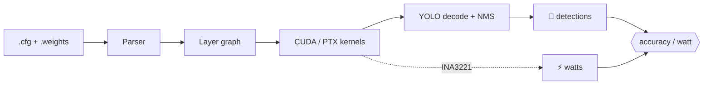

<!-- ─────────────────────────────  HEADER  ───────────────────────────── -->
<div align="center">


<a href="https://git.io/typing-svg"></a>

<br/>


</div>

---

## `$ whoami`

```cpp
struct Filip {
    const char* role      = "Final-year CS student @ FRI, Univ. of Ljubljana";
    const char* lab       = "ViCoS — Visual Cognitive Systems Lab";
    const char* next      = "MSc Computer & Embedded Systems Eng. @ TU Delft";
    const char* thesis    = "Hand-written C++/CUDA/PTX inference engine";
    const char* langs[2]  = {"Slovenian (native)", "English (C2)"};

    // what keeps me up at night
    const char* interests[4] = {
        "GPU kernels & low-level performance",
        "edge AI on power-constrained hardware",
        "embedded systems & robotics",
        "brain–machine interfaces & neural prosthetics",
    };
};
```

---

## 🔥 Currently building

<table>
<tr>
<td width="60%" valign="top">

### ⚡ A from-scratch inference engine for the Jetson Orin Nano

My bachelor's thesis: a YOLO inference engine written in **C++, CUDA and hand-tuned PTX** — no PyTorch, no TensorRT, no ONNX. Just custom kernels, a Darknet `.cfg`/`.weights` parser, and a power meter.

It's benchmarked head-to-head against **Darknet, TensorRT and ONNX Runtime**, and the score that matters is **accuracy-per-watt**, measured live off the board's **INA3221** power monitor.

</td>
<td width="40%" valign="top">

```text
 progress
 ─────────────────────────────
 ✅ Darknet cfg/weights parser
 ✅ CPU FP32 forward pass
 ✅ YOLO layer · decode · NMS
 ✅ validated vs Darknet outputs
 🔄 CUDA / PTX port
 ⏳ INT8 quantization
 ⏳ power-aware benchmarking
```

</td>
</tr>
</table>



---

## 🧰 Toolbox

<div align="center">

**Systems & GPU**<br/>


**Embedded & Robotics**<br/>


**Vision & ML**<br/>


**Backend**<br/>


</div>

---

## 🛠️ Things I've built

| Project | What it is | Stack |
|---|---|---|
| 🍩 **[STM-Donut-Clicker](https://github.com/Chiff0/STM-Donut-Clicker)** | The classic ASCII spinning donut — reborn as a clicker game on an STM32 board | `C` `STM32` |
| 🤖 **RINS Robotics** | Autonomous TurtleBot: navigation, ring detection & perception with ROS 2 | `ROS 2` `Python` `OpenCV` |
| 👁️ **Anomaly detection** | Computer-vision work on detecting defects and anomalies | `Python` `YOLO` |
| ⚡ **Inference engine** *(thesis)* | Framework-free YOLO inference, optimized for accuracy-per-watt | `C++` `CUDA` `PTX` |

<details>
<summary><b>🍩 psst — click for a donut</b></summary>

```text
                   $$$$$$$$$$$$$@$$
               ####*#############$$$$$$
              *!!!!!!!*!!!*********#######
            ==!==!===!!!!!!!!!!*!!********##
            ;;=;;;::;;;;;;;;;;====!!!!!*!*****
           :;::~~~--------~~~::::;;;===!=!!!!!!
            ~--,,.........,,----~~~:::;;;===!!=
            ,...................,,--~~:::;;;;;=;
            ............:= .........,--~~~::::;;
             ..........,=*#$@$#........,---~~~::
               ......,~:=*#$$#!;,........,,----
                 ...,-~;=*!!!==:-..........,,,
                    ..-~;==!!;;:-,...........
                         .,,----,,........
```

*Rendered with the same math that spins on the STM32.*

</details>

---

## 💼 Experience

```diff
+ Backend Developer (student)  ·  Sunesis d.o.o.                      Oct 2025 – Mar 2026
  Java / Quarkus services

+ Backend Developer (student)  ·  FRI — Lab for Integration of        May 2025 – Sep 2025
                                   Information Systems
```

---

## 🧭 Where I'm headed

> Right now I'm going deep on **CUDA, modern C++, concurrency and hardware-aware software** — and contributing back to the tools I use, starting with **Darknet**.
>
> Long-term, I want to work on technology that genuinely changes things for people. The one I can't stop thinking about: **brain–machine interfaces and neural prosthetics** — where real-time, low-power compute meets the brain.

---

## 📊 Stats

<div align="center">


</div>

---

<div align="center">

<sub>⚙️ <code>nvcc -O3 -arch=sm_87 life.cu -o filip</code> ⚙️</sub>


</div>
